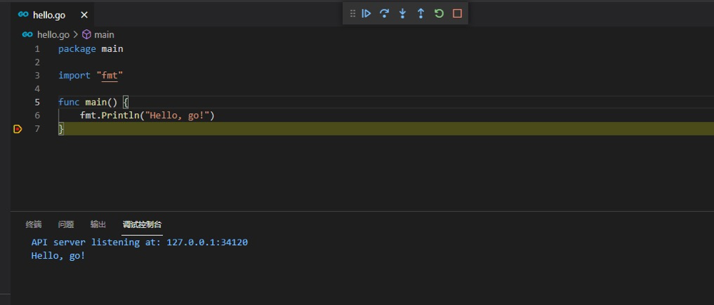

vscode是一个轻量级的文本编辑器，拥有丰富的插件系统，因此此套检查使用vs作为go的开发环境。环境搭建仅需要3步！

# 下载安装vscode

1、下载地址（官网）：[vscode](https://code.visualstudio.com/)  
2、一直下一步即可

# 下载安装Golang
1、下载地址（官网）：[golang](https://golang.google.cn/dl/)  
2、下载对应系统的安装程序进行安装即可，在当前版本（1.16）是不需要配置环境变量的  
3、配置proxy：[goproxy](https://github.com/goproxy/goproxy.cn)

# vscode安装必要插件
1、go  
2、按下快捷键ctrl+shift+p（mac：command+shift+p）输入go:install/update tools  然后回车，将会出现如下图片中的选择，将其全选后点击ok即可。  


# 编写HelloWorld检查环境
1、vscode打开一个文件夹，在命令行终端进入此文件夹并执行  
```shell
go mod init github.com/pingwazi/hello   #此命令是创建一个go.mod文件，当然也可以手动创建
```
2、创建hello.go文件  
```go
package main
import "fmt"
func main() {
    fmt.Println("Hello, go!")
}
```
打上断点，按下f5进行调试，当出现类似下图则说明环境已搭建成功。


# go在vscode控制台调试获取标准输入
1、安装delve  
> [官方文档](https://github.com/go-delve/delve)

2、delve安装成功后配置环境变量  
安装好之后，可执行文件在GOPATH环境变量下的bin目录中，对其配置环境变量即可。执行如下命令检查dlv安装情况    
> dlv version

3、执行命令启动调试服务端(网上还有结束创建tasks.json的方式，但是在windows中一直尝试成功，会不停的获得EOF)
>dlv debug --headless --listen=:2345 --log --api-version=2

4、配置launch.json
```json
{
    // 使用 IntelliSense 了解相关属性。 
    // 悬停以查看现有属性的描述。
    // 欲了解更多信息，请访问: https://go.microsoft.com/fwlink/?linkid=830387
    "version": "0.2.0",
    "configurations": [
        {
            "name": "stdin-go",
            "type": "go",
            "request": "launch",
            "mode": "remote",
            "port": 2345,
            "host": "127.0.0.1",
            "program": "${workspaceFolder}/src",
        }
    ]
}
```

# 复杂目录结构调试
当遇到可执行程序和main函数不在同一个目录时（例如调试kratos项目），还需要额外配置launch.json文件
```json
{
    // 使用 IntelliSense 了解相关属性。 
    // 悬停以查看现有属性的描述。
    // 欲了解更多信息，请访问: https://go.microsoft.com/fwlink/?linkid=830387
    "version": "0.2.0",
    "configurations": [
        {
            "name": "debug-go",
            "type": "go",
            "request": "launch",
            "mode": "auto",
            "program": "${workspaceFolder}/cmd/app",//指定入口程序所在目录
            "showLog":true,
            "output": "${workspaceFolder}/bin/app",//指定可执行文件输出目录
            "env": {"username":"pingwazi"},//配置环境变量
            "args": ["-env=test"]//配置启动参数
        }
    ]
}
```
