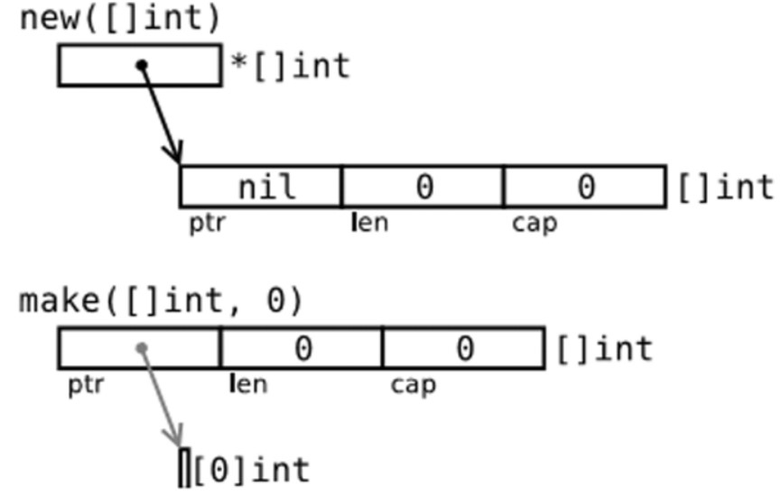

# new和make的区别
## 两者的返回值不同
1、new返回的是类型的T的指针  
2、make返回的是类型T本身
## 两者接受的参数不同
1、new只接受一个类型参数  
2、make除了接受类型参数外，还接受一个可变长度的参数
## 两者使用场景不同
1、new是分配内存，并初始化零值（值类型的零值为类型默认值，引用类型零值为空指针）
2、make是初始化一个类型T，常用于切片、map、channel


# 数组
数组是值类型，并且长度固定的，定义方式如下
```go
	var nums1 [2]int
	nums2 := [2]int{} //即使不赋值也需要写后面的花括号
	nums3 := [2]int{1, 2}
	nums4 := [...]int{1, 2} //长度自动推断
```
# 切片
切片是引用类型，长度是不固定的，并且可以在动态增加数据的情况下自动扩容，扩容方式如下。
- 如果新的大小是当前大小2倍以上，则大小增长为新大小
- 否则循环以下操作：如果当前大小小于1024，按每次2倍增长，否则每次按当前大小1/4增长。直到增长的大小超过或等于新大小。
```go 
	nums := [...]int{1, 2, 3, 4, 5, 6, 7}
	s1 := nums[1:4]            //通过数组获取一个切片
	s2 := make([]int, 10)      //通过make定义
	var s3 *[]int = new([]int) //通过new定义
```
## 实际感受下切片自动扩容过程
```go
func main() {
	s1 := make([]int, 100)
	s1Cap := cap(s1)
	fmt.Printf("长度=%d，容量=%d\r\n", len(s1), s1Cap)
	i := 0
	for i < 1000 {
		i++
		s1 = append(s1, i)
		if tempCap := cap(s1); tempCap != s1Cap {
			s1Cap = tempCap
			fmt.Printf("长度=%d，容量=%d\r\n", len(s1), cap(s1))
		}
	}
}
```

# 字典
一个无序的key-value数据结构
```go
func main() {
	map1 := map[string]string{"name": "xiaoping", "addr": "四川成都"}
	//map2 := make(map[string]string)
	var map3 map[string]string
	for _, value := range map1 {
		fmt.Println(value)
	}
	map3 = make(map[string]string)
	map3["addr"] = "四川"
	fmt.Printf("%v", map3)
}
```