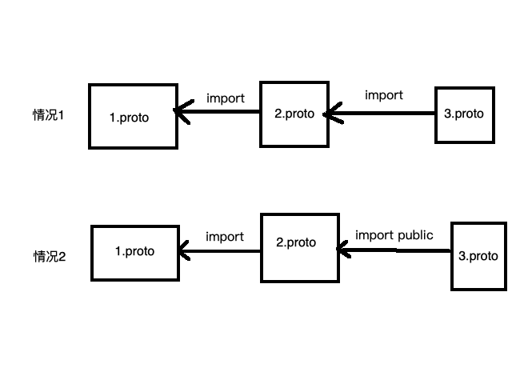

# 简介
一种序列化和反序列化的技术，可以类比json或者xml，但是比json和xml速度更快，存储空间占用率也更小。  
有跨语言、跨平台、兼容性好的特性  
通常用于通信项目中，因为序列化后传出的字节数相比json等序列化技术要小很多，这对节省带宽和提升传输速度都十分有效。  
由于序列化后的内容不是人能够看懂的（全是二进制编码），因此在某些场景下也不太适合（比如REST Api）,反而json更加使用。  
[官网](https://developers.google.cn/protocol-buffers/docs/proto3)

# 常用模式
在需要通过REST Api进行前后端交互场景，通常使用json序列化技术，因为json序列化后的内容更加易读  
在纯服务端交互的场景中，通常使用protobuf进行通讯，因为速度快呀、内存占用小啊

# 使用的必要条件
1、安装protoc翻译器  
2、需要编写**.proto文件，文件内容是proto特有的语法格式  
3、通过protobuf官方提供的proto翻译器，将proto文件翻译成对应语言的源文件  
4、特定的语言使用翻译后的源文件进行序列化和反序列化即可  

> 注：同一个proto通过protoc可以翻译为多种语言的源文件，通过这种方式实现的跨语言特性

# 安装protoc
1、去[Github](https://github.com/protocolbuffers/protobuf/releases)上下载对应环境的protoc安装包（windows下载win包，macos下载osx）  
2、配置环境变量(以macos举例)  
将下载的包的bin、include目录移动到/usr/local/protobuf目录中  
执行如下命令添加环境变量  
```shell
#修改.bash_profile文件，将如下内容添加到文件末尾
export PROTOBUF=/usr/local/protobuf 
export PATH=$PROTOBUF/bin:$PATH
```
刷新环境变量
```shell
source .bash_profile # 回到用户路径下执行
```
3、验证
```shell
protoc --version 
```

# 先来一个HelloWorld
此例子使用go语言为例  
1、在go中需要使用protobuf还需要安装protoc-gen-go，这个组件是通过proto文件生成对应的go源文件。
```shell
go get github.com/golang/protobuf/protoc-gen-go
```

2、编写proto文件
```proto
syntax = "proto3"; //指明协议版本
option go_package = "./;main";//分号前面部分，表示文件放在哪里，后面部分是报名，在go 1.14之后，必须要这个

message User{
    string name=1;
    int32 count=2;
}

```
3、执行命令生成对应go源文件夹
```shell
protoc --go_out=. *.proto
```
4、最终会生成一个user.pb.go文件  

5、go中进行序列化和反序列化
```go
func main() {
	user := &User{Name: "xiaoping", Count: 1}
	ret, err := proto.Marshal(user) //序列化
	if err != nil {
		log.Fatal(err)
	}
	fmt.Println(ret)

	user1 := &User{}
	proto.Unmarshal(ret, user1) //反序列化
	fmt.Println(user1)
}
```

# proto语法介绍
> [proto3中移除required和optional的原因](https://github.com/protocolbuffers/protobuf/issues/2497)


## syntax
定义proto3版本的proto文件，在第一行需要指定此文件使用的proto版本，否则默认使用proto2。
```proto
syntax = "proto3";
```

## message
这是一个关键字，作用类似java/C#中的class，go中的struct关键字。message中可以嵌套定义message类型。如下:
```proto
message User{
	string message=1;
	string addr=2;
	message Eat{
		string etype=1;
	}
	Eat eat=3;
}
```
1、字段规则  
在proto3中有两种字段规则，一是singular（0或者1个，但不能多于1个），二是repeated（任意数量（包括0））。  
但是规则1是[默认规则](https://github.com/protocolbuffers/protobuf/issues/3457)，不需要也不能再编码中体现，否则翻译是会报错

2、 字段类型  
请参考[官网](https://developers.google.cn/protocol-buffers/docs/proto3)  

3、数字Tag  
每一个字段都需要有一个数字tag（也就是数字编号），因为在进行序列化后，二进制数据中使用的是变量的编号，而非变量名本身（这是压缩后尺寸小的一个原因）  
Tag的取值范围最小是1，最大是 2^29 - 1 或 536,870,911，但 19000~19999 是 protobuf 预留的，用户不能使用    
- 1 ~ 15：单字节编码
- 16 ~ 2047：双字节编码

因此对于使用频率高的字段建议使用1~15的编号  

4、reserved  
作用是设置保留变量名或者tag值。思考下，为什么需要这个关键字呢？  
目前的场景有两个：  
一是以后需要使用这些变量名或者tag。  
二是已经删除了的变量名和tag，防止后面的人又来重新使用。
```proto
message User{
    // 同一个 reserved 语句不能同时包含变量名和 Tag 
    reserved 1;
    reserved "name";
    //string name=1;
	string addr=2;
	message Eat{
		string etype=1;
	}
	Eat eat=3;
}
```

## enum
定义枚举的关键字，proto中定义枚举需要确保第一个枚举值必须是0，并且枚举值不能重复  
除非使用 option allow_alias = true 选项来开启别名
```proto
enum Season{
    //option allow_alias = true;//允许别名
    Spring=0;
    //Spring1=0;
    Summer=1;
    Autumn=2;
    Winter=3;
}
```
## 引用其他proto文件
使用import关键字导入其他proto文件，不过在导入时存在public使用和不使用的两种情况。


- 在情况1中， 1.proto 不能使用 3.proto 中定义的内容
- 在情况2中， 1.proto 可以使用 3.proto 中定义的内容
- 情况1和2中，1.proto 都可以使用 2.proto
- 情况1和2中，2.proto 都可以使用 3.proto

## 升级proto文件的一点建议
- 不要修改任何已存在的变量的 Tag
- 如果你新增了变量，新生成的代码依然能解析旧的数据，但新增的变量将会变成默认值。相应的，新代码序列化的数据也能被旧的代码解析，但旧代码会自动忽略新增的变量。
- 废弃不用的变量用 reserved 标注
- int32、 uint32、 int64、 uint64 和 bool 是相互兼容的，这意味你可以更改这些变量的类型而不会影响兼容性
- sint32 和 sint64 是兼容的，但跟其他类型不兼容
- string 和 bytes 可以兼容，前提是他们都是UTF-8编码的数据
- fixed32 和 sfixed32 是兼容的, fixed64 和 sfixed64是兼容的

## any的使用
> proto.any在安装文件中，以我mac的环境为例，这个文件在安装包的include目录下。他需要和bin目录在一起。
Any可以让你在 proto 文件中使用未定义的类型，具体里面保存什么数据，是在上层业务代码使用的时候决定的，使用 Any 必须导入 import google/protobuf/any.proto

```proto
syntax = "proto3"; //指明协议版本
option go_package = "./;main";//分号前面部分，表示文件放在哪里，后面部分是报名，在go 1.14之后，必须要这个
import "google/protobuf/any.proto";

message User{
    repeated string name=1;
	string addr=2;
	message Eat{
		string etype=1;
	}
	Eat eat=3;
    google.protobuf.Any data=4;
}
```
## oneof
表示只使用一组字段中的一个，如果遇到类似情况，使用这个关键字可以节省序列化后的存储空间。
```proto
message User{
	oneof sex{
		bool man=1;
		bool woman=2;
	}
	string name=3;
}
```
## map
map是编程语言中场景的类型，proto中也支持map类型的定义。  
>注：map类型的key必须是int或者string，value的类型可以是任意类型
```proto
message User{
	map<string,string> nickName=1;
}
```

## package
为防止不同proto文件中的message类型名称重复而冲突，可以在编写proto文件的时候，使用package关键字声明message类型所属包

## option
出现在proto文件定义的顶部，常用于控制proto文件翻译的相关信息  
- 例如option go_package="";
- 例如option optimize_for=SPEED 可选有 [SPEED|CODE_SIZE|LITE_RUNTIME] ，分别是效率优先、空间优先，第三个lite是兼顾效率和代码大小，但是运行时需要依赖 libprotobuf-lite

# 总结
至此，protobuf相关知识点已介绍得差不多了，内容涵盖了protoc的安装、protobuf的基本使用、proto文件语法格式等，基本满足了日常的开发使用。下一节我们将学习gRPC框架，通过gRPC框架巩固protobuf的使用。
