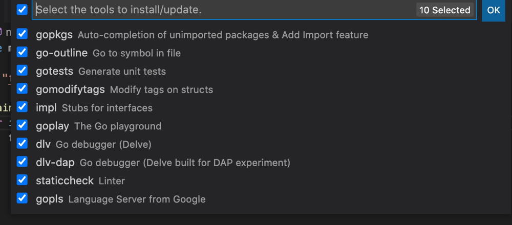

vscode是一个轻量级的文本编辑器，拥有丰富的插件系统，因此此套检查使用vs作为go的开发环境。环境搭建仅需要3步！

# 一、下载安装vscode

1、下载地址（官网）：[vscode](https://code.visualstudio.com/)  
2、一直下一步即可

# 2、下载安装Golang
1、下载地址（官网）：[golang](https://golang.google.cn/dl/)  
2、下载对应系统的安装程序进行安装即可，在当前版本（1.16）是不需要配置环境变量的  
3、配置proxy：[goproxy](https://github.com/goproxy/goproxy.cn)

# 3、vscode安装必要插件
1、go  
2、按下快捷键ctrl+shift+p（mac：command+shift+p）输入go:install/update tools  然后回车，将会出现如下图片中的选择，将其全选后点击ok即可。  


# 4、编写HelloWorld检查环境
1、vscode打开一个文件夹，在命令行终端进入此文件夹并执行  
```shell
go mod init pingwazi.com/hello   #此命令是创建一个go.mod文件，当然也可以手动创建
```
2、创建hello.go文件  
```go
package main
import "fmt"
func main() {
    fmt.Println("Hello, go!")
}
```
打上断点，按下f5进行调试，当出现类似下图则说明环境已搭建成功。


